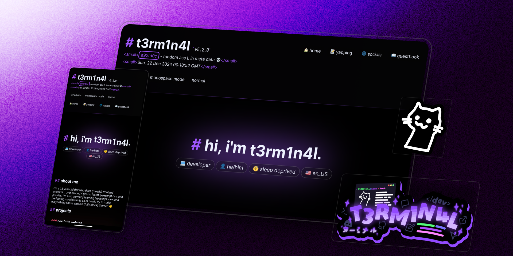

# t3rm1n4l's personal site 

<a href="https://t3rm1n4l.dev">
  
</a>


Personal site/portfolio/blog, built with [Bun](https://bun.sh/), [Astro](https://astro.build/), and [SCSS](https://tailwindcss.com/), and hosted on [Cloudflare Workers](https://workers.cloudflare.com/)! ft. aesthetic, and a responsive, mobile-friendly design. 


## Development

1. Clone the source code to your device
```sh
git clone https://github.com/T3M1N4L/site
```

2. Install the project's dependencies
```sh
bun install
```

3. Start the development server on `localhost:4321`
```sh
bun run dev
```
4. Build the static site to `/dist`
```sh
bun run build
```

this is astro ssr btw for faster load times
### Notes
- Standard astro layout
- Pretext?!
- Pokemon, shinies are 1/100
- awesome animations
- haptics?!
- Images are stored in `public/img`

### Roadmap
- [ ] better center gradient for the wavy `t3rm1n4l`
- [ ] clean up code especially css 
- [ ] make the overlapping stuff begone!